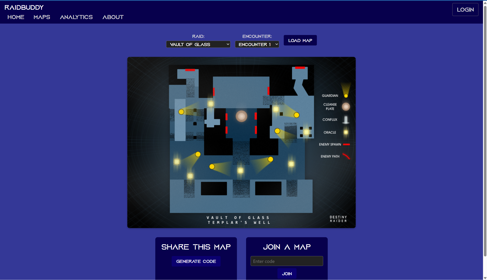

# RaidBuddy: Destiny 2 Raid Guide and Collaborative Map Tool

RaidBuddy is a web application designed to help Destiny 2 players plan, coordinate, and execute raids. It provides interactive raid maps, step-by-step guides, and collaborative annotation features so fireteams can strategize in real-time. Users can view detailed guides for each raid, see maps for specific encounters, and work together to annotate those maps to explain tactics and positions.

## Deliverable 1: Project Specification

### Elevator pitch
Ever tried tackling a Destiny 2 raid without a clear plan and ended up wiped multiple times? RaidBuddy is here to help. With interactive guides, annotated maps, and collaborative drawing features, fireteams can plan strategies, assign roles, and visualize encounter mechanics — all in one place. Whether you’re learning the raid for the first time or coordinating a top-tier team, RaidBuddy makes raids easier, faster, and more fun.

### Design

  
*Placeholder sketch for layout of home page, map page, and guide pages.*

### Key features
- Detailed written guides for all Destiny 2 raids  
- Interactive maps for raid encounters  
- Collaborative real-time annotations via WebSockets  
- Ability to create or join a map with a code  
- Integration with Bungie API for analytics on your fireteam’s raids  
- Responsive design that works on desktops, tablets, and mobile devices  
- Clear navigation between home, guides, maps, analytics, and about pages  

### Technologies
I am going to use the required technologies in the following ways:

- **HTML** – Basic structural and organizational elements for all pages, including home, about, raid guides, collaborative maps, and analytics pages.  
- **CSS** – Styling and animating the application, including responsive layouts, color schemes, spacing, typography, hover effects, and interactive elements like raid tiles and buttons.  
- **React** – Componentization, routing, and user reactivity using the React framework and JavaScript. React will handle switching between raid guides, rendering collaborative map components, and updating UI in response to real-time events.  
- **Web service** – Endpoints provided by the backend service that support application-specific functionality, such as creating or joining collaborative maps, saving and retrieving annotations, and fetching raid guide content. Also includes integration with a third-party API: [Bungie API](https://www.bungie.net/platform) for player analytics and raid stats.  
- **Database** – Store authentication data (if added later) and persistent application data, such as map states, annotations, and user-generated guides.  
- **WebSocket** – Real-time information pushed from the backend to the frontend, enabling live collaborative annotation of raid maps and instant updates for all connected users.

## 🚀 HTML deliverable  
For this deliverable I did the following. I checked the box [x] and added a description for things I completed.

- [x] HTML pages – Created multiple pages: `index.html` (Home page), `analytics.html` (API analytics display), `col-map.html` (collaborative map placeholder), and `about.html`. Each page has a header, main, and footer structure.  
- [x] Proper HTML element usage – Used semantic elements including `header`, `footer`, `main`, `nav`, `form`, `label`, `input`, `button`, and `a`. The login form uses proper input types and labels for accessibility.  
- [x] Links – Footer and header allow navigation between pages.  
- [x] Text – Pages include descriptive text placeholders for analytics, player stats, and information about the app.  
- [x] 3rd party API placeholder – `analytics.html` has a structured area for Bungie API analytics such as recent activities, kills, deaths, and completion times.  
- [x] Images – About page has a placeholder image for branding or app info.  
- [x] Login placeholder – `index.html` has a minimal login form with username/password fields and a submit button.  
- [x] DB data placeholder – `analytics.html` will eventually display player activity data fetched from the API.  
- [x] WebSocket placeholder – `col-map.html` has a live activity section where dynamic updates will appear in the future.

## 🚀 CSS deliverable  
For this deliverable I did the following. I checked the box [x] and added a description for things I completed.

- [x] Header, footer, and main content body – Created a common CSS file `main.css` for global layout, including flexbox for vertical and horizontal alignment. Footer is pinned to the bottom with proper styling.  
- [x] Navigation elements – Styled header navigation links consistently across all pages, including hover effects and active states.  
- [x] Responsive to window resizing – Flexbox and responsive width settings ensure all pages adapt to mobile and desktop views.  
- [x] Application elements – Used flex containers and gap/padding to align forms, analytics cards, and page sections.  
- [x] Application text content – Applied `system-ui` font with color schemes consistent across all pages (#fff text on #343897 background).  
- [x] Application images – About page image is centered and responsive.  
- [x] Login page styling – Minimal login page uses consistent colors, borders, hover effects, and form alignment with the rest of the site theme.  
- [x] API analytics page styling – `analytics.html` has placeholder cards styled with flexbox, background colors, and consistent typography ready for dynamic API data.

## React Phase 1: Routing deliverable

For this deliverable I converted my static HTML application into a React single-page application (SPA) with client-side routing. The application now uses React components and React Router to handle navigation without full page reloads.

- [x] I completed the prerequisites for this deliverable (deployed to Simon, GitHub link present, Git commits made)

- [x] Bundled using Vite - The frontend was scaffolded using Vite, which provides fast builds, hot module replacement (HMR), and optimized production bundling.

- [x] Components - The application is organized into reusable React components, including:
  - App - Root component responsible for defining routes and overall layout.
  - Header and Footer - Shared layout components displayed across all routes.
  - Home - Landing page introducing RaidBuddy and displays available raids and links to detailed guide views.
  - Map - Placeholder for the collaborative raid map interface.
  - Analytics - Placeholder for Bungie API integration and player stats.
  - About - Information about the application and its purpose.
  - Login - Login page

- [x] Router - Implemented client-side routing using react-router-dom. The following routes are configured:
  - / -> Home
  - /{raid name} -> Relevant raid guide page
  - /map -> Collaborative map page
  - /analytics -> Player analytics page
  - /about -> About page
  - /login -> Login page

Navigation links in the header allow seamless transitions between pages without reloading the browser.

- [x] Shared layout structure - The Header and Footer components persist across all routes, while routed components render inside the main content area.

- [x] Placeholder integration for future phases:
  - The Map page contains structural placeholders for future WebSocket-based real-time collaboration.
  - The Analytics page contains structured placeholders for Bungie API data.

## React Phase 2: Interactivity

For this deliverable I implemented client-side interactivity using React so that the application fully works for a single user. I also added placeholders and mocked functionality for future backend integration.

- [x] I completed the prerequisites for this deliverable (Simon deployed, GitHub link, Git commits)
- [x] All functionality implemented or mocked out – Users can select a map, draw on it, generate a join code, and join an existing session to view the same drawing. Multiplayer functionality is mocked using localStorage. The analytics page fetches and displays dummy data.
- [x] Hooks – Used useState for UI state management, useEffect for canvas initialization and image loading side effects, and useRef for persistent canvas references.